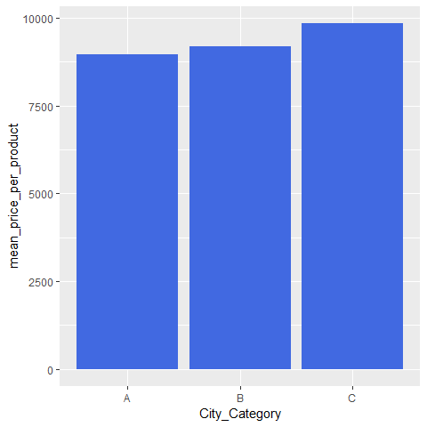

Hey, guys! Today we look at the Black Friday data. Let's dive and see what is in store for us.


```r
library(tidyverse)
library(ggrepel)
library(lubridate)
library(scales)
library(highcharter)
library(ggpubr)

b <- read_csv("BlackFriday.csv")
sapply(b, function(x) sum(is.na(x)))
```

```
##                    User_ID                 Product_ID 
##                          0                          0 
##                     Gender                        Age 
##                          0                          0 
##                 Occupation              City_Category 
##                          0                          0 
## Stay_In_Current_City_Years             Marital_Status 
##                          0                          0 
##         Product_Category_1         Product_Category_2 
##                          0                     166986 
##         Product_Category_3                   Purchase 
##                     373299                          0
```

```r
b_cat <- b%>% 
  gather(product_cat, category, c("Product_Category_1", "Product_Category_2", "Product_Category_3")) %>%
  select(-product_cat) %>%
  filter(!is.na(category))
```

#Who said the data is totally incognito?!

Let's look at what we have for the occupation of customers.

<!-- -->

Based on these results we could assume that occupation 10 is School and 4 - College/University. Occupation 10 is most widespread among 0-17 years old customers whereas, occupation 4 - among 18-25 and than 26-35 age group.

Next on we look at the preferences of both occupation groups(4 and 10) in regards to product categories:

<!-- -->

It appears that students (at school) buy much less products than university students in  city A, In contrast to city C where the former have more buying power.

#Where is it most expensive or do people buy more expensive stuff there?

The next figure represents the mean price per purchase across the three cities.

<!-- -->

The figure highlights that city C has slightly higher mean price per sale, which could lead to the idea that either it sells more expensive products, or the prices are just higher.

#Most popular categories

Product category presents an interesting feature of the sold products. Each product could fall in up to 3 categories. 
NB! Some product can have just one category and others up to 3, so if a product falling into 3 categories is very well bought that could distort the results

<!-- -->

Clearly the most popular products are the ones falling into 1, 5 and 8 categories. In addition it seems as categories 12-18 (especially 14-16) are somewhat secondary (meantioned in either Product_Category_2 or Product_Category_3).

#Gender patterns

Let's observe whether there's any clear pattern in terms of the gender of the consumers.

<!-- -->

Considering the left figure it seems that most of the customer are in the 18-45 Age group. Approximatelly 40 % of all purchases have been made by people from the 25-36 group. A peculiar difference between city A and C is that the latter sees rather more sales in the 46+ age groups. On the other hand, city B had more than 40 % of all sales.

In regards to the figure on the right is represents a ratio of Male versus Female customers in an attempt to identify whether either has certain consumption patterns related to age. Despite the lack of widespread pattern it is worth noting that the in city A man in 46-50 and 55+ seemed to buy more often than women as compared to other age groups. In contrast, in the 0-17 age group female customers were more than male.

#Categories across ages as percentage of all sales

Next on we observe whether there's any preference of any age group to certain category. Percentages of all bought items per age group are used as they are more fair than absolute values.

<!-- -->

No clear patterns are presented here. Nevertheless it seems products from categories 3 and 4 are being better accepted by the 0-17 age group.

#Highest revenue categories

Here we have the division of revenue by categories of goods.

<!-- -->

Category 1 leads the race with a "slight" lead over 5 and 8.

#Mean price of bought products across categories

That is another way of assessing the categories as their popularity does not tell it all.

<!-- -->

Here we see that two of the most popular categories 5 and 8 have a relatively low mean price. On the other hand category 1 seems to be the more expensive in regards to mean product price.

#Product prices

Next we look at the frequency count of different product prices across the three cities.

<!-- -->

There are 2 interesting spikes:
* in the 7-9K range;
* in the 15-17K range.

We look at there in the next figure.

<!-- -->

It now becomes clear that the 5 and 8 categories could be the most popular, but even though 1 is not as popular it twice more expensive.

#Average number of bought items across cities

The following figure consists of 4 parts. In practice if you multiply the 1st to the 2nd you will get the 3rd. The last one(bottom right) is a more general one.

<!-- -->

City C sees less sales not because of the lack of customers but rather because on average they buy much less products than in other cities.

#Stay in the city

Let's look at how the number of customer is influenced by the duration of stay in the city across age groups.

<!-- -->

The most prominent category is the one of customers living for no more than an year in this city. Together with the fact the most clients are aged 25-36 it somehow leads me to the idea that the store itself could be selling furniture.

That's just my guess though. I'm curious to see what is yours.

#Conslusions
* school students in city C buy more stuff than those in other cities
* Most popular categories by far are 5 and 8 followed by 1. In addition, the latter generates highest revenue for the company.
* There are pronounced customer gender patterns in some age groups in city A
* City C sees less sales not because of the lack of customers but rather because on average they buy much less products than in other cities.
* The most prominent stay-in-the-city group is of customers living for no more than an year in the city in question.
