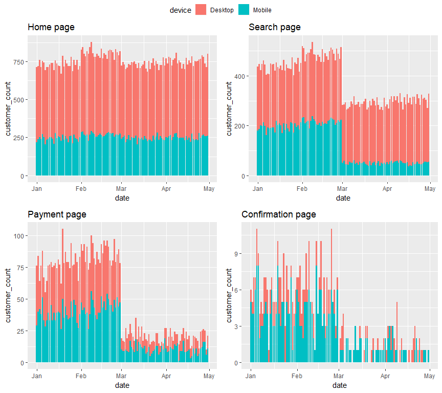
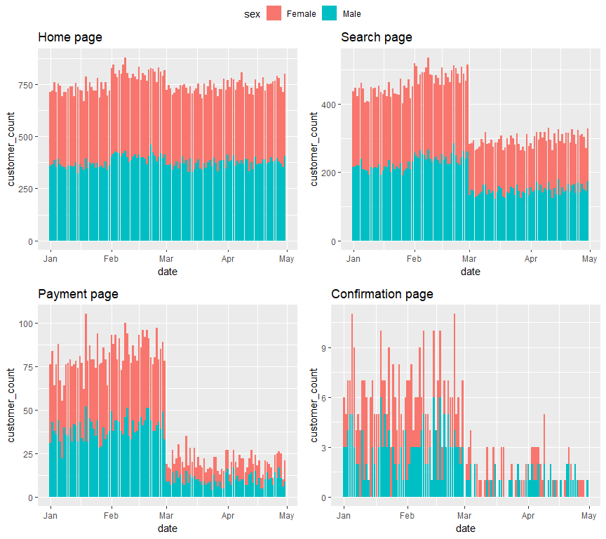
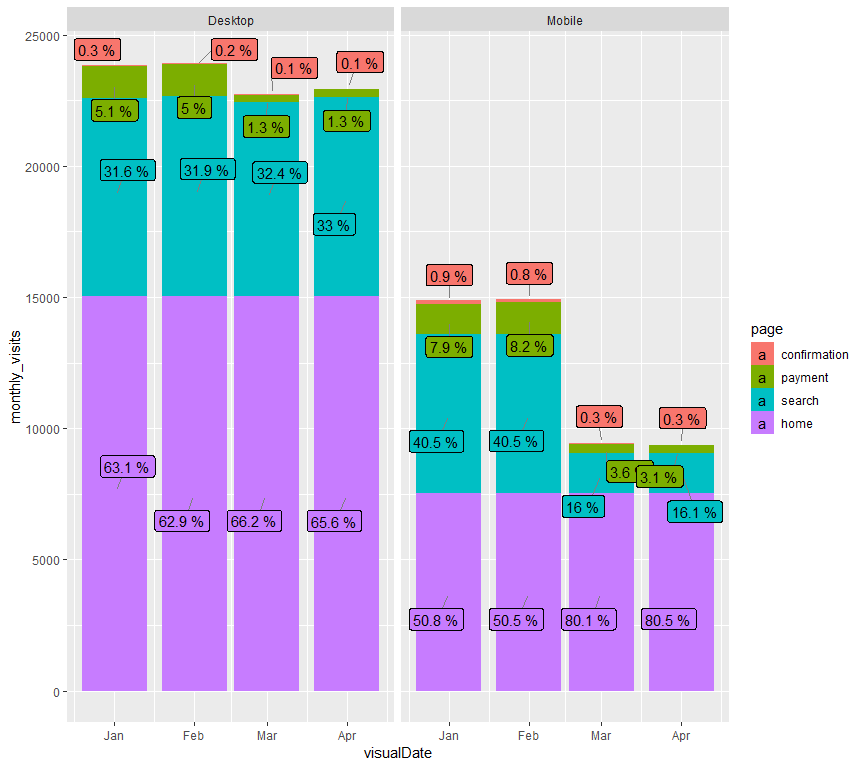
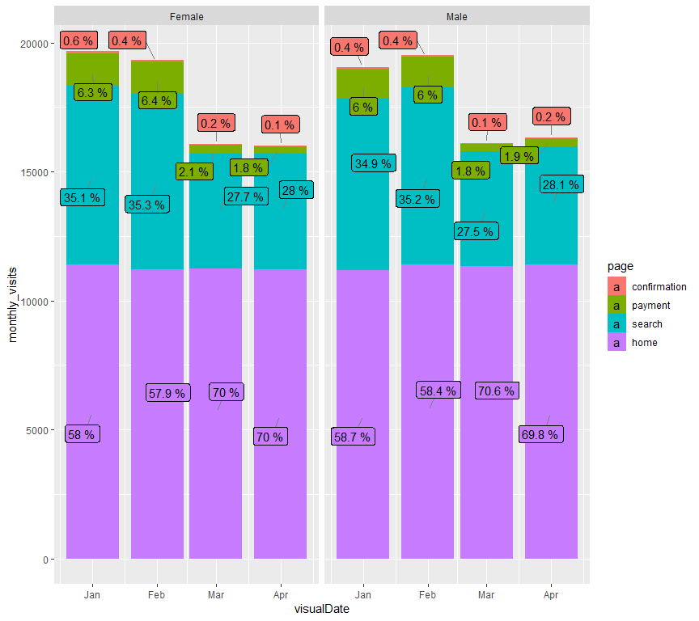

Today we are looking at data from an e-commerce website that is registering the number of visits on each ofits pages (home, search, payment and confirmation).


```r
library(tidyverse)
library(lubridate)
library(ggrepel)
library(ggpubr)

home_page <- read_csv("home_page_table.csv")
search_page <- read_csv("search_page_table.csv")
payment_page <- read_csv("payment_page_table.csv")
confirmation_page <- read_csv("payment_confirmation_table.csv")
user_table <- read_csv("user_table.csv")

f <- user_table %>%
  left_join(home_page, by = "user_id") %>%
  left_join(search_page, by = "user_id") %>%
  left_join(payment_page, by = "user_id") %>%
  left_join(confirmation_page, by = "user_id")

range(f$date)
```

```
## [1] "2015-01-01" "2015-04-30"
```

```r
pages <- c("home", "search", "payment", "confirmation")
colnames(f)[5:8] <- pages

#Do people come twice - retention?----
length(unique(f$user_id))
```

```
## [1] 90400
```

It seems that the data contains one-time users only. This might signify that the retention website is not at all effective.

#Visit counts

The following section presents information on the daily visits of different pages of the website. Thus, the y-axis presents daily values.

##By device

The following figure presents the visit count on each of the pages across devices from Jan 2015 to end of Apr 2015.

<!-- -->

From March on there is a clear decline of visits from the mobile devices on the Search page and onwards. Again from March on, the Payment page sees less visitors than in the past, considering that the Home page visits remain on previous levels.

##By gender

Next on we look at whether there is a pattern related to the gender behaviour.

<!-- -->

The dip in March is visible here too. Nevertheless the balance between male and female customers is kept to roughly 50/50.

#Percentages

The following section presents aggregated monthly values on the y-axis as well as labels that signify the percentage of the visits on certain page from the total website visit this month.

##By device

Let's see whether the results from above are confirmed.

<!-- -->

Several things could be marked from the figures above:

* Until March the mobile version of the website had better conversion rates than the Desktop version even though its absolute values were lower.
* Even after March the convertion rate of the Search-to-Payment-to-Confirmation page remains the same, the conversion from Home-to-Search page drops dramatically.
* On the other hand, the Desktop registers a drop in the conversion from Search to Payment.

##By gender
<!-- -->

The figures above signify that there are no significant differences between M/F customers. They experience the same dips in conversion rates which may highlight that they are related to the appearence of the website and inappropriate guidance of the users rather than some gender related issue.

#Conslusions

Some final observations to conclude the analysis with are:

* The desktop version had lower Search-Payment-Confirmation conversion rate than the mobile one but only up to the end of February.
* From March on the mobile version's Home-Search page conversion fell dramatically and even though it sustained the same amount of home page visitors it could not register improvements.
* From March on the Search-Payment pages convertion rate for the desktop version of the website also fell which led to a decrease of the visits of subsequent pages too.
* The datasets consists of one time users only, which in reality would never be the case.
