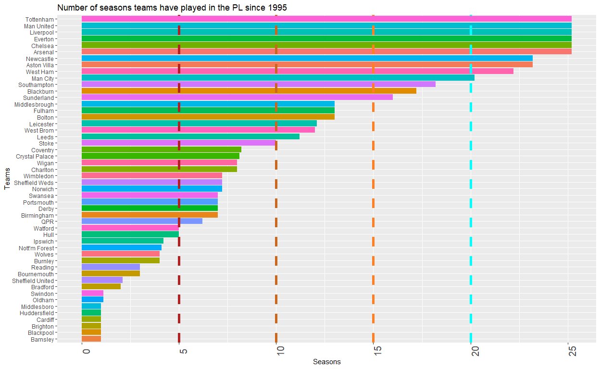
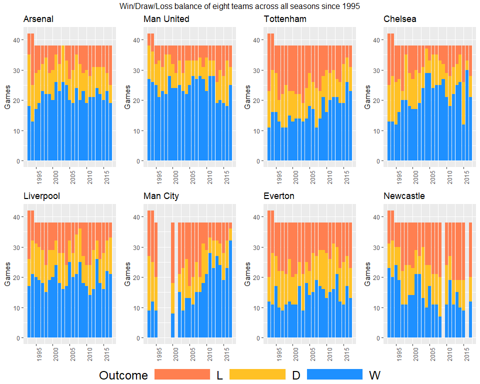
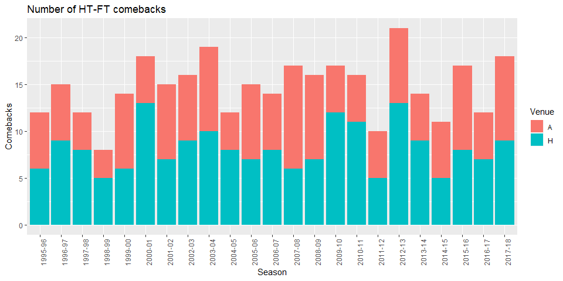
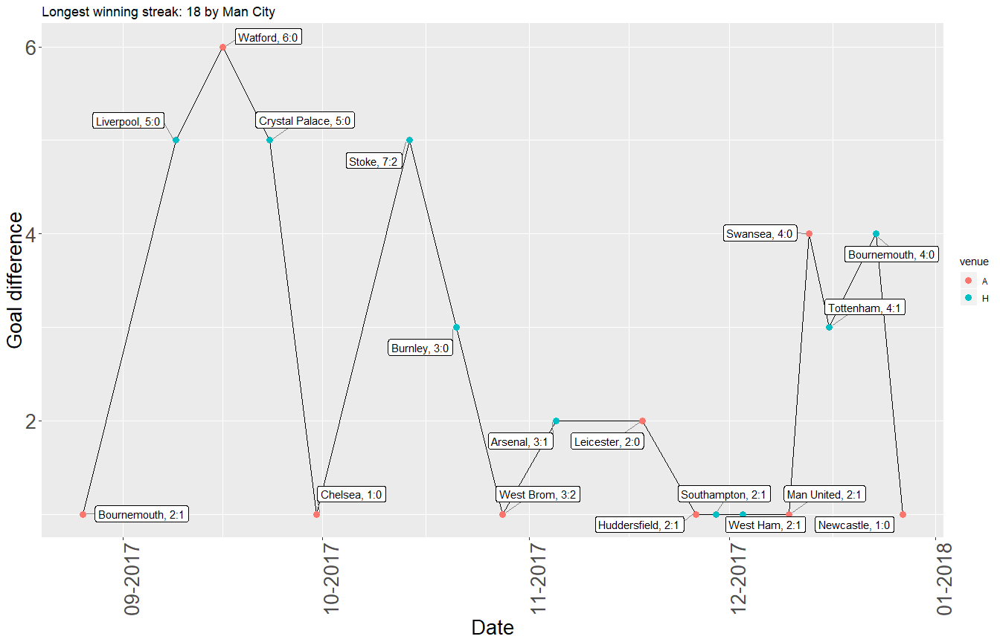
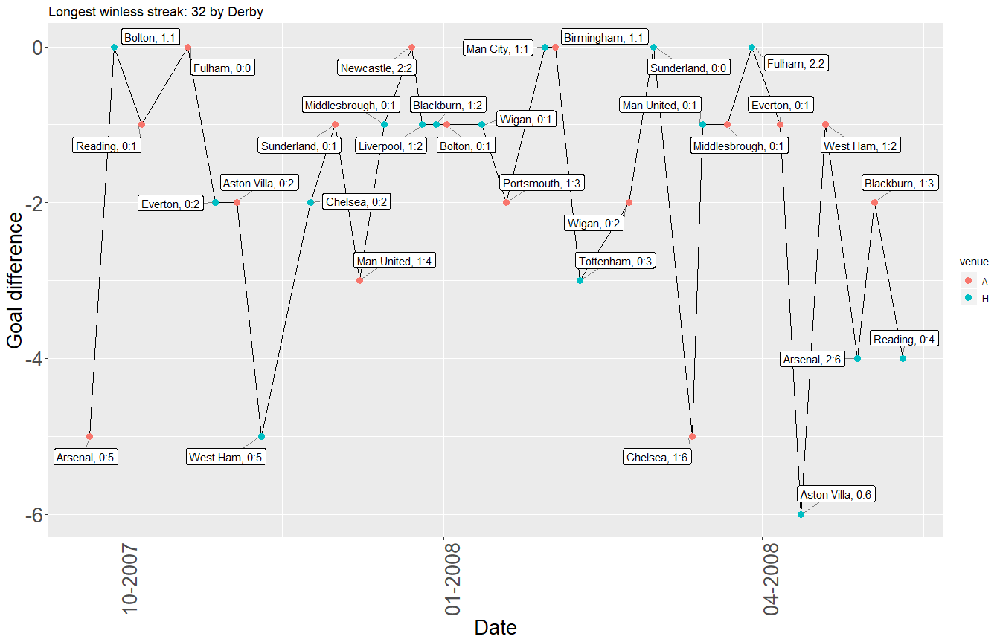
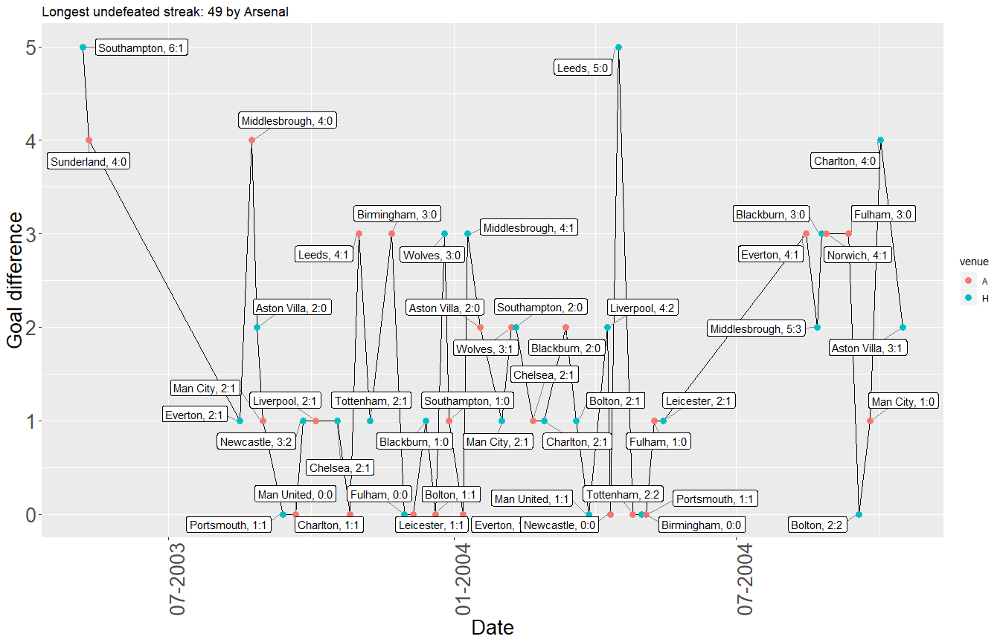
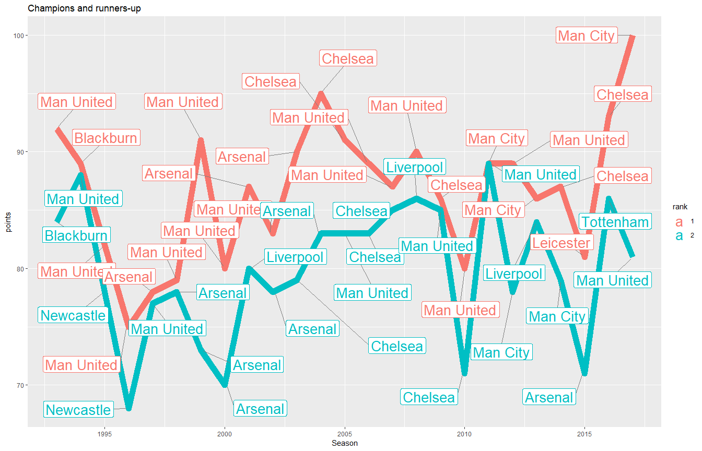

Hey, guys!

Here's my EDA on the PL fixtures. From them I also derived the seasonal standings. Have a look below and see what I found.


```r
library(tidyverse)
```

```
## Warning: package 'tidyverse' was built under R version 3.4.4
```

```
## -- Attaching packages ------------------------------------------------------------------------------------------------ tidyverse 1.2.1 --
```

```
## v ggplot2 3.0.0     v purrr   0.2.4
## v tibble  1.4.2     v dplyr   0.7.4
## v tidyr   0.8.0     v stringr 1.2.0
## v readr   1.1.1     v forcats 0.2.0
```

```
## Warning: package 'ggplot2' was built under R version 3.4.4
```

```
## -- Conflicts --------------------------------------------------------------------------------------------------- tidyverse_conflicts() --
## x dplyr::filter() masks stats::filter()
## x dplyr::lag()    masks stats::lag()
```

```r
library(ggrepel)
```

```
## Warning: package 'ggrepel' was built under R version 3.4.4
```

```r
library(lubridate)
```

```
## Warning: package 'lubridate' was built under R version 3.4.4
```

```
## 
## Attaching package: 'lubridate'
```

```
## The following object is masked from 'package:base':
## 
##     date
```

```r
library(ggpubr)
```

```
## Warning: package 'ggpubr' was built under R version 3.4.4
```

```
## Loading required package: magrittr
```

```
## 
## Attaching package: 'magrittr'
```

```
## The following object is masked from 'package:purrr':
## 
##     set_names
```

```
## The following object is masked from 'package:tidyr':
## 
##     extract
```

```r
library(scales)
```

```
## Warning: package 'scales' was built under R version 3.4.4
```

```
## 
## Attaching package: 'scales'
```

```
## The following object is masked from 'package:purrr':
## 
##     discard
```

```
## The following object is masked from 'package:readr':
## 
##     col_factor
```

```r
library(highcharter)
```

```
## Warning: package 'highcharter' was built under R version 3.4.4
```

```
## Highcharts (www.highcharts.com) is a Highsoft software product which is
```

```
## not free for commercial and Governmental use
```

```r
d <- read.csv("EPL_Set.csv", header = TRUE)
d <- d %>%
  mutate_if(is.factor, as.character) %>%
  mutate(Date = dmy(Date))
```

# How long they have been in the EPL?

```r
#Number of seasons played in the EPL since 1995
fiveSeasons <- list("firebrick", 2, "dashed", 5)
tenSeasons <- list("chocolate3", 2, "dashed", 10)
fifteenSeasons <- list("chocolate1", 2, "dashed", 15)
twentySeasons <- list("cyan", 2, "dashed", 20)

d %>% group_by(HomeTeam) %>%
  summarise(Seasons = n()*2/38) %>%
  ggplot(aes(x = reorder(HomeTeam, Seasons), y = Seasons, fill = HomeTeam)) +
  geom_bar(stat = "identity") +
  theme(axis.text.x.bottom = element_text(angle = 90)) +
  coord_flip() +
  xlab("Teams") +
  guides(fill=FALSE) +
  theme(axis.text.x.bottom = element_text(size = 15)) +
  ggtitle("Number of seasons teams have played in the PL since 1995") + 
  geom_hline(yintercept=fiveSeasons[[4]], linetype=fiveSeasons[[3]], size=fiveSeasons[[2]], color = fiveSeasons[[1]]) +
  geom_hline(yintercept=tenSeasons[[4]], linetype=tenSeasons[[3]], size=tenSeasons[[2]], color = tenSeasons[[1]]) +
  geom_hline(yintercept=fifteenSeasons[[4]], linetype=fifteenSeasons[[3]], size=fifteenSeasons[[2]], color = fifteenSeasons[[1]]) +
  geom_hline(yintercept=twentySeasons[[4]], linetype=twentySeasons[[3]], size=twentySeasons[[2]], color = twentySeasons[[1]])
```

<!-- -->

# Top teams' W/D/L balance

```r
#Win/Draw/Lose balance across seasons
wdlBalance <- function(dataset = d, team = ""){
    dataset %>%
    filter(HomeTeam == team | AwayTeam == team) %>%
    mutate(venue = ifelse(HomeTeam == team, "H", "A"),
           result = ifelse(HomeTeam == team & FTR == "H", "W",
                           ifelse(AwayTeam == team & FTR == "A", "W",
                                  ifelse(HomeTeam == team & FTR == "A", "L",
                                         ifelse(AwayTeam == team & FTR == "H", "L",
                                                ifelse(FTR == "D", "D", NA))))),
           Season = as.Date(paste0("01/01/", substr(Season, 1, 4)),format = "%d/%m/%Y")) %>%
    group_by(Season, venue) %>%
    summarise(W = sum(result == "W"),
              D = sum(result == "D"),
              L = sum(result == "L")) %>%
    gather(Outcome, Games, 3:5)%>%
    mutate(Outcome = factor(Outcome, c("L", "D", "W"))) %>%
    ggplot(aes(x = Season, y = Games, fill = Outcome)) +
    geom_bar(stat = "identity") +
    scale_fill_manual(values = c("coral", "goldenrod1","dodgerblue1")) +
    ggtitle(team) +
    theme(axis.title.x.bottom = element_blank(),
          axis.text.x.bottom = element_text(angle = 90),
          legend.position = "bottom",
          legend.direction = "horizontal",
          legend.key.width = unit(3, "cm"),
          legend.text = element_text(size = 18),
          legend.title = element_text(size = 18))
}

wdlTeams <- c("Arsenal", "Man United", "Tottenham", "Chelsea",   
                  "Liverpool", "Man City", "Everton",  "Newcastle")
wdl <- list()

for (teamIndex in 1:length(wdlTeams)) {
  var = as.character(wdlTeams[teamIndex])
  plot = wdlBalance(team = var)
  wdl[[teamIndex]] <- eval(substitute(plot))
}
```

Please note that the 1993-94 and 1994-95 seasons saw 22 playing in the PL.

```r
p <- do.call(ggarrange, c(plotlist = wdl, nrow = 2, ncol = 4, common.legend = TRUE, legend = "bottom"))
annotate_figure(p, top = "Win/Draw/Loss balance of eight teams across all seasons since 1995")
```

<!-- -->

# Comebacks: What a drama!?!

Look at that! That's the number of comebacks per season. Unless you are on the wrong side of the scoreboard, it's always fun to watch these games. Here's theit distribution in time.

Note: No HT-FT data is available for 1993-94 and 1994-95 season

```r
#Comebacks per season----
comebacks <- function(dataset = d, period = unique(d$Season)){
  dataset %>%
    filter(Season %in% period) %>%
    mutate(comeback = ifelse(HTHG < HTAG & FTHG > FTAG, 1,
                             ifelse(HTHG > HTAG & FTHG < FTAG, 1, 0)),
           Venue = ifelse(HTHG < HTAG & FTHG > FTAG, "H",
                             ifelse(HTHG > HTAG & FTHG < FTAG, "A", NA))) %>%
    filter(comeback == 1) %>%
    group_by(Season, Venue) %>%
    summarise(Comebacks = sum(comeback)) %>%
    ggplot(aes(x = Season, y = Comebacks, fill = Venue)) +
    geom_bar(stat = "identity") +
    ggtitle("Number of HT-FT comebacks") +
    theme(axis.text.x.bottom = element_text(angle = 90))
}

comebacks()
```

<!-- -->

The following functions make it possible to identify sequences of difference game outcomes.

```r
#identifies the latest streak so that its indices could be used for the subset of the dataset
findStreakIndices <- function(sequence, wholePeriod){
  indices <- str_split(wholePeriod, sequence)
  lastPeriod <- nchar(indices[[1]][length(indices[[1]])]) #length of the period after last longest winning streak
  lst <- list()
  start <- nchar(wholePeriod) - lastPeriod - nchar(sequence) + 1
  end <- nchar(wholePeriod) - lastPeriod
  
  lst(start, end)
}

#Gets a team's longest(and most recent) streak of a specified outcome
typeOfStreakFun <- function(outcome, team){
    # W - streak of wins,
    # U - streak of games without loss,
    # D - streak of draws,
    # X - streak of games without wins,
    # L - streak of losses
  #winning streak
  if (outcome == "W") {
    dataset <- d %>%
      filter(HomeTeam == team | AwayTeam == team) %>%
      mutate(result = ifelse(HomeTeam == team & FTR == "H", "W",
                             ifelse(AwayTeam == team & FTR == "A", "W",NA)),
             goalDiff = ifelse(HomeTeam == team & FTR == "H", FTHG - FTAG,
                               ifelse(AwayTeam == team & FTR == "A", FTAG - FTHG, NA)))
  } 
  #undefeated streak
  else if(outcome == "U"){
    dataset <- d %>%
      filter(HomeTeam == team | AwayTeam == team) %>%
      mutate(result = ifelse(HomeTeam == team & FTR == "H", "U",
                             ifelse(AwayTeam == team & FTR == "A", "U",
                                    ifelse(FTR == "D", "U", NA))),
             goalDiff = ifelse(HomeTeam == team & FTR == "H", FTHG - FTAG,
                               ifelse(AwayTeam == team & FTR == "A", FTAG - FTHG,
                                      ifelse(FTR == "D", 0, NA))))
  }
  #streak of losses
  else if(outcome == "L"){
    dataset <- d %>%
      filter(HomeTeam == team | AwayTeam == team) %>%
      mutate(result = ifelse(HomeTeam == team & FTR == "A", "L",
                             ifelse(AwayTeam == team & FTR == "H", "L", NA)),
             goalDiff = ifelse(HomeTeam == team & FTR == "A", FTHG - FTAG,
                               ifelse(AwayTeam == team & FTR == "H", FTAG - FTHG, NA)))
  }
  #streak without wins
  else if(outcome == "X"){
    dataset <- d %>%
      filter(HomeTeam == team | AwayTeam == team) %>%
      mutate(result = ifelse(HomeTeam == team & FTR == "A", "X",
                             ifelse(AwayTeam == team & FTR == "H", "X", 
                                    ifelse(FTR == "D", "X", NA))),
             goalDiff = ifelse(HomeTeam == team & FTR == "A", FTHG - FTAG,
                               ifelse(AwayTeam == team & FTR == "H", FTAG - FTHG, 
                                      ifelse(FTR == "D", 0, NA))))
  }
  #streak of draws
  else if(outcome == "D"){
    dataset <- d %>%
      filter(HomeTeam == team | AwayTeam == team) %>%
      mutate(result =  ifelse(FTR == "D", "D", NA))
  }

  dataset <- dataset %>%
    mutate(opponent = ifelse(HomeTeam == team, AwayTeam, HomeTeam),
           venue = ifelse(HomeTeam == team, "H", "A"),
           score = ifelse(HomeTeam == team, paste(FTHG, FTAG, sep= ":"), paste(FTAG, FTHG, sep= ":"))) %>%
    mutate(label = paste(opponent, score, sep = ", ")) %>%
    select(-opponent, venue, -score)
  
  
  dataset
}

#Gets longest(and most recent) streak of a specified outcome across all teams
longestStreakFun <- function(dataset, outcome){
  streaks <- rle(x = dataset$result)
  
  #When NA is converted to character it distorts the indexing; O stands for other
  dataset$result[which(is.na(dataset$result))] <- "O"
  maxStreak <- max(streaks$lengths)
  
  #character representataions of both the winning streak and the whole period's results
  sequence <- paste0(rep(outcome, times = maxStreak), collapse = '')
  results <- paste0(dataset$result, collapse = '')
  indices <- findStreakIndices(sequence, results)
  
  subset <- dataset[indices$start:indices$end,] %>%
    mutate(Date = as.Date(Date)) %>%
    arrange(Date)
  
  lst <- list(maxStreak, subset)
}

streakFun <- function(outcome){
  teams <- unique(d$HomeTeam)
  longestStreak <- 0
  detailsStreak <- data.frame()
  longestStreakTeam <- ""
  
  for (team in teams) {
    data <- typeOfStreakFun(outcome, team)
    teamsStreak <- longestStreakFun(data, outcome)
    if(teamsStreak[[1]] > longestStreak){
      longestStreak <- teamsStreak[[1]]
      detailsStreak <- teamsStreak[[2]]
      longestStreakTeam <- team
    }
  }
  
  lst <- list(longestStreakTeam, longestStreak, detailsStreak)
  lst
}
```
# Streaks {.tabset}

The y-axis on the figures below represents the goal difference, thus they highlight not only the length of a streak but also confidence of the attacking (winning/undefeated streak) or defending players(winless streak).

Please use the tabs to explore all longest streaks regarding the outcome.

## Winning

```r
wins <- streakFun("W")

winsTitle <- paste("Longest winning streak:", wins[[2]], "by", wins[[1]])
winsDat <- wins[[3]]
winsDat %>%
  arrange(Date) %>%
  ggplot(aes(x = Date, y = goalDiff, group = 1)) +
  geom_line() +
  geom_point(aes(color = venue), size = 3) + 
  geom_label_repel(aes(label = label),
                   box.padding   = 0.35, 
                   point.padding = 0.5,
                   segment.color = 'grey50') +
  ggtitle(winsTitle) +
  ylab("Goal difference") +
  scale_x_date(labels = date_format("%m-%Y")) +
  theme(axis.text.x.bottom = element_text(size = 20, angle = 90),
        axis.text.y.left = element_text(size = 20),
        axis.title.y.left = element_text(size = 20),
        axis.title.x.bottom = element_text(size = 20))
```

<!-- -->

## Winless

```r
noWin <- streakFun("X")
noWinTitle <- paste("Longest winless streak:", noWin[[2]], "by", noWin[[1]])
noWinDat <- noWin[[3]]

noWinDat %>%
  arrange(Date) %>%
  ggplot(aes(x = Date, y = goalDiff, group = 1)) +
  geom_line() +
  geom_point(aes(color = venue), size = 3) + 
  geom_label_repel(aes(label = label),
                   box.padding   = 0.35, 
                   point.padding = 0.5,
                   segment.color = 'grey50') +
  ggtitle(noWinTitle) +
  scale_x_date(labels = date_format("%m-%Y")) +
  ylab("Goal difference") +
  theme(axis.text.x.bottom = element_text(size = 20, angle = 90),
        axis.text.y.left = element_text(size = 20),
        axis.title.y.left = element_text(size = 20),
        axis.title.x.bottom = element_text(size = 20))
```

<!-- -->

##Undefeated

```r
undefeated <- streakFun("U")
undefeatedTitle <- paste("Longest undefeated streak:", undefeated[[2]], "by", undefeated[[1]])
undefeatedDat <- undefeated[[3]]

undefeatedDat %>%
  arrange(Date) %>%
  ggplot(aes(x = Date, y = goalDiff, group = 1)) +
  geom_line() +
  geom_point(aes(color = venue), size = 3) + 
  geom_label_repel(aes(label = label),
                   box.padding   = 0.35, 
                   point.padding = 0.5,
                   segment.color = 'grey50') +
  ggtitle(undefeatedTitle) +
  scale_x_date(labels = date_format("%m-%Y")) +
  ylab("Goal difference") +
  theme(axis.text.x.bottom = element_text(size = 20, angle = 90),
        axis.text.y.left = element_text(size = 20),
        axis.title.y.left = element_text(size = 20),
        axis.title.x.bottom = element_text(size = 20))
```

<!-- -->

#Standings

##Computing poins
Having the games list and their outcomes allows to compute the points out of a game, sum them up and end up with points, GD, and goals scored in a season.

```r
pointsPerSeasonFun <- function(dataset = d, team){
  d %>%
    filter(HomeTeam == team | AwayTeam == team) %>%
    mutate(points = ifelse(HomeTeam == team & FTR == "H", 3,
                           ifelse(AwayTeam == team & FTR == "A", 3,
                                  ifelse(FTR== "D", 1, 0))),
           goalDiff = ifelse(HomeTeam == team, FTHG - FTAG, FTAG - FTHG),
           goalsScored = ifelse(HomeTeam == team, FTHG, FTAG),
           team = team) %>%
    group_by(Season, team) %>%
    summarise(points = sum(points), goalDiff = sum(goalDiff), goalsScored = sum(goalsScored)) %>%
    select(Season, team,points, goalsScored, goalDiff)
}

teams <- unique(d$HomeTeam)

#PPS stands for points per season
pps <- data.frame()
pps <- pps %>%
  mutate(Season = as.character(NA),
         team = as.character(NA),
         points = as.numeric(NA),
         goalsScored = as.numeric(NA),
         goalDiff = as.numeric(NA))


for (team in teams) {
  teamsPointsPerSeason <- pointsPerSeasonFun(team = team)
  pps <- pps %>% bind_rows(teamsPointsPerSeason)
}
```

##Computing standings
Having computed the points we could then group by season and derive the rankings.

```r
standings <- pps %>%
  group_by(Season) %>%
  arrange(Season, desc(points), desc(goalDiff), desc(goalsScored)) %>%
  mutate(rank = row_number(Season))
```

##Number of titles
I feel like I owe it to the Man Utd and Chelsea fans and I've included the number of titles won by any team in the Premier League era.

```r
standings %>%
  filter(rank == 1) %>%
  group_by(team) %>%
  summarise(titles = n()) %>%
  hchart('treemap', hcaes(x = 'team', value = 'titles', color = 'titles', size = 20)) %>%
  hc_add_theme(hc_theme_sandsignika()) %>%
  hc_title(text="Premier League Titles")
```

<!--html_preserve--><div id="htmlwidget-4733d7d492d997a1b89a" style="width:100%;height:500px;" class="highchart html-widget"></div>
<script type="application/json" data-for="htmlwidget-4733d7d492d997a1b89a">{"x":{"hc_opts":{"title":{"text":"Premier League Titles"},"yAxis":{"title":{"text":[]},"type":"linear"},"credits":{"enabled":false},"exporting":{"enabled":false},"plotOptions":{"series":{"turboThreshold":0,"showInLegend":false,"marker":{"enabled":true}},"treemap":{"layoutAlgorithm":"squarified"},"bubble":{"minSize":5,"maxSize":25},"scatter":{"marker":{"symbol":"circle"}}},"annotationsOptions":{"enabledButtons":false},"tooltip":{"delayForDisplay":10},"colorAxis":{"auxpar":null},"series":[{"group":"group","data":[{"team":"Arsenal","titles":3,"value":3,"colorValue":3,"size":20,"name":"Arsenal"},{"team":"Blackburn","titles":1,"value":1,"colorValue":1,"size":20,"name":"Blackburn"},{"team":"Chelsea","titles":5,"value":5,"colorValue":5,"size":20,"name":"Chelsea"},{"team":"Leicester","titles":1,"value":1,"colorValue":1,"size":20,"name":"Leicester"},{"team":"Man City","titles":3,"value":3,"colorValue":3,"size":20,"name":"Man City"},{"team":"Man United","titles":12,"value":12,"colorValue":12,"size":20,"name":"Man United"}],"type":"treemap"}],"xAxis":{"type":"category","title":{"text":"team"},"categories":null}},"theme":{"colors":["#F45B5B","#8085E9","#8D4654","#7798BF","#AAEEEE","#FF0066","#EEAAEE","#55BF3B","#DF5353"],"chart":{"backgroundColor":null,"divBackgroundImage":"http://www.highcharts.com/samples/graphics/sand.png","style":{"fontFamily":"Signika, serif"}},"title":{"style":{"color":"black","fontSize":"16px","fontWeight":"bold"}},"subtitle":{"style":{"color":"black"}},"tooltip":{"borderWidth":0},"legend":{"itemStyle":{"fontWeight":"bold","fontSize":"13px"}},"xAxis":{"labels":{"style":{"color":"#6e6e70"}}},"yAxis":{"labels":{"style":{"color":"#6e6e70"}}},"plotOptions":{"series":{"shadow":false},"candlestick":{"lineColor":"#404048"},"map":{"shadow":false}},"navigator":{"xAxis":{"gridLineColor":"#D0D0D8"}},"rangeSelector":{"buttonTheme":{"fill":"white","stroke":"#C0C0C8","stroke-width":1,"states":{"select":{"fill":"#D0D0D8"}}}},"scrollbar":{"trackBorderColor":"#C0C0C8"},"background2":"#E0E0E8"},"conf_opts":{"global":{"Date":null,"VMLRadialGradientURL":"http =//code.highcharts.com/list(version)/gfx/vml-radial-gradient.png","canvasToolsURL":"http =//code.highcharts.com/list(version)/modules/canvas-tools.js","getTimezoneOffset":null,"timezoneOffset":0,"useUTC":true},"lang":{"contextButtonTitle":"Chart context menu","decimalPoint":".","downloadJPEG":"Download JPEG image","downloadPDF":"Download PDF document","downloadPNG":"Download PNG image","downloadSVG":"Download SVG vector image","drillUpText":"Back to {series.name}","invalidDate":null,"loading":"Loading...","months":["January","February","March","April","May","June","July","August","September","October","November","December"],"noData":"No data to display","numericSymbols":["k","M","G","T","P","E"],"printChart":"Print chart","resetZoom":"Reset zoom","resetZoomTitle":"Reset zoom level 1:1","shortMonths":["Jan","Feb","Mar","Apr","May","Jun","Jul","Aug","Sep","Oct","Nov","Dec"],"thousandsSep":" ","weekdays":["Sunday","Monday","Tuesday","Wednesday","Thursday","Friday","Saturday"]}},"type":"chart","fonts":"Signika","debug":false},"evals":[],"jsHooks":[]}</script><!--/html_preserve-->

##Point difference between champion and runner-up
Last but not least, we have diffrence in points between the champion and the runner-up. Labels are also added to signify the actual winner and second-placed teams.

```r
standings %>%
  ungroup() %>%
  mutate(Season = as.Date(paste0("01/01/", substr(Season, 1, 4)),format = "%d/%m/%Y")) %>% #That's just for better visualization on the x-axis
  group_by(Season) %>%
  filter(rank %in% c(1,2)) %>%
  select(Season, team, points, rank) %>%
  mutate(rank = factor(rank, c(1,2))) %>%
  ggplot(aes(x = Season, y = points)) +
  geom_line(aes(color = rank, size = 1.5)) +
  geom_label_repel(aes(label = team, color = rank),
                  box.padding   = 1, 
                  point.padding = 0.5,
                  segment.color = 'grey50',
                  size = 7) +
  scale_size(guide = "none") +
  ggtitle("Champions and runners-up")
```

<!-- -->
