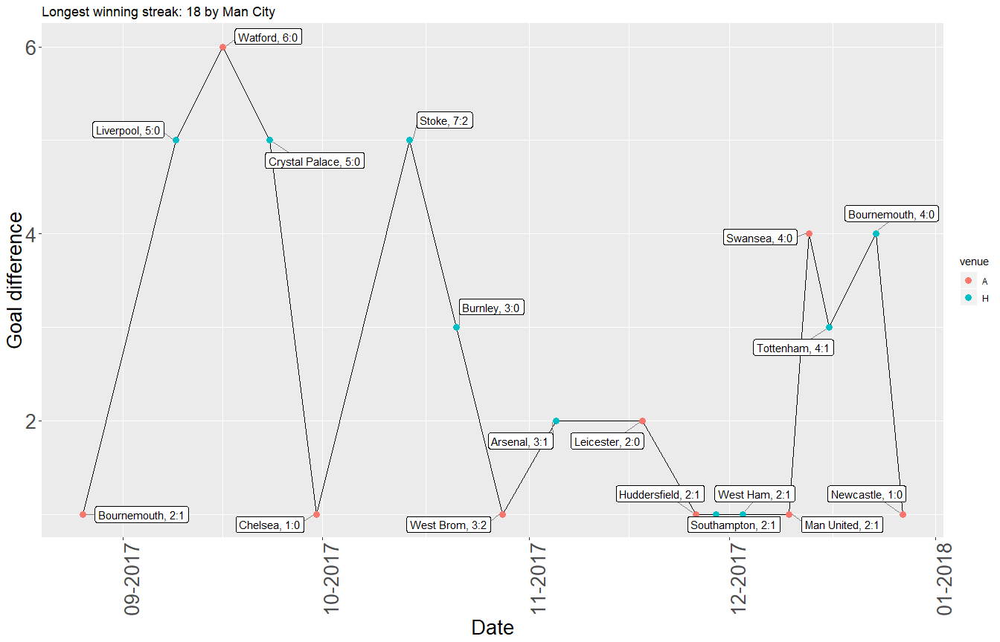

```r
library(tidyverse)
```

```
## Warning: package 'tidyverse' was built under R version 3.4.4
```

```
## -- Attaching packages ---------------------------------------------------------------------------------------------------------------------------------- tidyverse 1.2.1 --
```

```
## v ggplot2 3.0.0     v purrr   0.2.4
## v tibble  1.4.2     v dplyr   0.7.4
## v tidyr   0.8.0     v stringr 1.2.0
## v readr   1.1.1     v forcats 0.2.0
```

```
## Warning: package 'ggplot2' was built under R version 3.4.4
```

```
## -- Conflicts ------------------------------------------------------------------------------------------------------------------------------------- tidyverse_conflicts() --
## x dplyr::filter() masks stats::filter()
## x dplyr::lag()    masks stats::lag()
```

```r
library(ggrepel)
```

```
## Warning: package 'ggrepel' was built under R version 3.4.4
```

```r
library(lubridate)
```

```
## Warning: package 'lubridate' was built under R version 3.4.4
```

```
## 
## Attaching package: 'lubridate'
```

```
## The following object is masked from 'package:base':
## 
##     date
```

```r
library(ggpubr)
```

```
## Warning: package 'ggpubr' was built under R version 3.4.4
```

```
## Loading required package: magrittr
```

```
## 
## Attaching package: 'magrittr'
```

```
## The following object is masked from 'package:purrr':
## 
##     set_names
```

```
## The following object is masked from 'package:tidyr':
## 
##     extract
```

```r
library(scales)
```

```
## Warning: package 'scales' was built under R version 3.4.4
```

```
## 
## Attaching package: 'scales'
```

```
## The following object is masked from 'package:purrr':
## 
##     discard
```

```
## The following object is masked from 'package:readr':
## 
##     col_factor
```

```r
d <- read.csv("EPL_Set.csv", header = TRUE)
d <- d %>%
  filter(!as.character(Season) %in% c("1993-94", "1994-95")) %>%
  mutate_if(is.factor, as.character) %>%
  mutate(Date = dmy(Date))
```


```r
#Number of seasons played in the EPL since 1995
fiveSeasons <- list("firebrick", 2, "dashed", 5)
tenSeasons <- list("chocolate3", 2, "dashed", 10)
fifteenSeasons <- list("chocolate1", 2, "dashed", 15)
twentySeasons <- list("cyan", 2, "dashed", 20)

d %>% group_by(HomeTeam) %>%
  summarise(Seasons = n()*2/38) %>%
  ggplot(aes(x = reorder(HomeTeam, Seasons), y = Seasons, fill = HomeTeam)) +
  geom_bar(stat = "identity") +
  theme(axis.text.x.bottom = element_text(angle = 90)) +
  coord_flip() +
  xlab("Teams") +
  guides(fill=FALSE) +
  theme(axis.text.x.bottom = element_text(size = 15)) +
  ggtitle("Number of seasons teams have played in the PL since 1995") + 
  geom_hline(yintercept=fiveSeasons[[4]], linetype=fiveSeasons[[3]], size=fiveSeasons[[2]], color = fiveSeasons[[1]]) +
  geom_hline(yintercept=tenSeasons[[4]], linetype=tenSeasons[[3]], size=tenSeasons[[2]], color = tenSeasons[[1]]) +
  geom_hline(yintercept=fifteenSeasons[[4]], linetype=fifteenSeasons[[3]], size=fifteenSeasons[[2]], color = fifteenSeasons[[1]]) +
  geom_hline(yintercept=twentySeasons[[4]], linetype=twentySeasons[[3]], size=twentySeasons[[2]], color = twentySeasons[[1]])
```

<!-- -->


```r
#Win/Draw/Lose balance across seasons
wdlBalance <- function(dataset = d, team = ""){
    dataset %>%
    filter(HomeTeam == team | AwayTeam == team) %>%
    mutate(venue = ifelse(HomeTeam == team, "H", "A"),
           result = ifelse(HomeTeam == team & FTR == "H", "W",
                           ifelse(AwayTeam == team & FTR == "A", "W",
                                  ifelse(HomeTeam == team & FTR == "A", "L",
                                         ifelse(AwayTeam == team & FTR == "H", "L",
                                                ifelse(FTR == "D", "D", NA))))),
           Season = as.Date(paste0("01/01/", substr(Season, 1, 4)),format = "%d/%m/%Y")) %>%
    group_by(Season, venue) %>%
    summarise(W = sum(result == "W"),
              D = sum(result == "D"),
              L = sum(result == "L")) %>%
    gather(Outcome, Games, 3:5)%>%
    mutate(Outcome = factor(Outcome, c("L", "D", "W"))) %>%
    ggplot(aes(x = Season, y = Games, fill = Outcome)) +
    geom_bar(stat = "identity") +
    scale_fill_manual(values = c("coral", "goldenrod1","dodgerblue1")) +
    ggtitle(team) +
    theme(axis.title.x.bottom = element_blank(),
          axis.text.x.bottom = element_text(angle = 90),
          legend.position = "bottom",
          legend.direction = "horizontal",
          legend.key.width = unit(3, "cm"),
          legend.text = element_text(size = 18),
          legend.title = element_text(size = 18))
}

wdlTeams <- c("Arsenal", "Man United", "Tottenham", "Chelsea",   
                  "Liverpool", "Man City", "Everton",  "Newcastle")
wdl <- list()

for (teamIndex in 1:length(wdlTeams)) {
  var = as.character(wdlTeams[teamIndex])
  plot = wdlBalance(team = var)
  wdl[[teamIndex]] <- eval(substitute(plot))
}
```


```r
p <- do.call(ggarrange, c(plotlist = wdl, nrow = 2, ncol = 4, common.legend = TRUE, legend = "bottom"))
annotate_figure(p, top = "Win/Draw/Loss balance of eight teams across all seasons since 1995")
```

<!-- -->


```r
#Comebacks per season----
comebacks <- function(dataset = d, period = unique(d$Season)){
  dataset %>%
    filter(Season %in% period) %>%
    mutate(comeback = ifelse(HTHG < HTAG & FTHG > FTAG, 1,
                             ifelse(HTHG > HTAG & FTHG < FTAG, 1, 0)),
           Venue = ifelse(HTHG < HTAG & FTHG > FTAG, "H",
                             ifelse(HTHG > HTAG & FTHG < FTAG, "A", NA))) %>%
    filter(comeback == 1) %>%
    group_by(Season, Venue) %>%
    summarise(Comebacks = sum(comeback)) %>%
    ggplot(aes(x = Season, y = Comebacks, fill = Venue)) +
    geom_bar(stat = "identity") +
    ggtitle("Number of HT-FT comebacks") +
    theme(axis.text.x.bottom = element_text(angle = 90))
}

comebacks()
```

<!-- -->


```r
#identifies the latest streak so that its indices could be used for the subset of the dataset
findStreakIndices <- function(sequence, wholePeriod){
  indices <- str_split(wholePeriod, sequence)
  lastPeriod <- nchar(indices[[1]][length(indices[[1]])]) #length of the period after last longest winning streak
  lst <- list()
  start <- nchar(wholePeriod) - lastPeriod - nchar(sequence) + 1
  end <- nchar(wholePeriod) - lastPeriod
  
  lst(start, end)
}

#Gets a team's longest(and most recent) streak of a specified outcome
typeOfStreakFun <- function(outcome, team){
    # W - streak of wins,
    # U - streak of games without loss,
    # D - streak of draws,
    # X - streak of games without wins,
    # L - streak of losses
  #winning streak
  if (outcome == "W") {
    dataset <- d %>%
      filter(HomeTeam == team | AwayTeam == team) %>%
      mutate(result = ifelse(HomeTeam == team & FTR == "H", "W",
                             ifelse(AwayTeam == team & FTR == "A", "W",NA)),
             goalDiff = ifelse(HomeTeam == team & FTR == "H", FTHG - FTAG,
                               ifelse(AwayTeam == team & FTR == "A", FTAG - FTHG, NA)))
  } 
  #undefeated streak
  else if(outcome == "U"){
    dataset <- d %>%
      filter(HomeTeam == team | AwayTeam == team) %>%
      mutate(result = ifelse(HomeTeam == team & FTR == "H", "U",
                             ifelse(AwayTeam == team & FTR == "A", "U",
                                    ifelse(FTR == "D", "U", NA))),
             goalDiff = ifelse(HomeTeam == team & FTR == "H", FTHG - FTAG,
                               ifelse(AwayTeam == team & FTR == "A", FTAG - FTHG,
                                      ifelse(FTR == "D", 0, NA))))
  }
  #streak of losses
  else if(outcome == "L"){
    dataset <- d %>%
      filter(HomeTeam == team | AwayTeam == team) %>%
      mutate(result = ifelse(HomeTeam == team & FTR == "A", "L",
                             ifelse(AwayTeam == team & FTR == "H", "L", NA)),
             goalDiff = ifelse(HomeTeam == team & FTR == "A", FTHG - FTAG,
                               ifelse(AwayTeam == team & FTR == "H", FTAG - FTHG, NA)))
  }
  #streak without wins
  else if(outcome == "X"){
    dataset <- d %>%
      filter(HomeTeam == team | AwayTeam == team) %>%
      mutate(result = ifelse(HomeTeam == team & FTR == "A", "X",
                             ifelse(AwayTeam == team & FTR == "H", "X", 
                                    ifelse(FTR == "D", "X", NA))),
             goalDiff = ifelse(HomeTeam == team & FTR == "A", FTHG - FTAG,
                               ifelse(AwayTeam == team & FTR == "H", FTAG - FTHG, 
                                      ifelse(FTR == "D", 0, NA))))
  }
  #streak of draws
  else if(outcome == "D"){
    dataset <- d %>%
      filter(HomeTeam == team | AwayTeam == team) %>%
      mutate(result =  ifelse(FTR == "D", "D", NA))
  }

  dataset <- dataset %>%
    mutate(opponent = ifelse(HomeTeam == team, AwayTeam, HomeTeam),
           venue = ifelse(HomeTeam == team, "H", "A"),
           score = ifelse(HomeTeam == team, paste(FTHG, FTAG, sep= ":"), paste(FTAG, FTHG, sep= ":"))) %>%
    mutate(label = paste(opponent, score, sep = ", ")) %>%
    select(-opponent, venue, -score)
  
  
  dataset
}

#Gets longest(and most recent) streak of a specified outcome across all teams
longestStreakFun <- function(dataset, outcome){
  streaks <- rle(x = dataset$result)
  
  #When NA is converted to character it distorts the indexing; O stands for other
  dataset$result[which(is.na(dataset$result))] <- "O"
  maxStreak <- max(streaks$lengths)
  
  #character representataions of both the winning streak and the whole period's results
  sequence <- paste0(rep(outcome, times = maxStreak), collapse = '')
  results <- paste0(dataset$result, collapse = '')
  indices <- findStreakIndices(sequence, results)
  
  subset <- dataset[indices$start:indices$end,] %>%
    mutate(Date = as.Date(Date)) %>%
    arrange(Date)
  
  lst <- list(maxStreak, subset)
}

streakFun <- function(outcome){
  teams <- unique(d$HomeTeam)
  longestStreak <- 0
  detailsStreak <- data.frame()
  longestStreakTeam <- ""
  
  for (team in teams) {
    data <- typeOfStreakFun(outcome, team)
    teamsStreak <- longestStreakFun(data, outcome)
    if(teamsStreak[[1]] > longestStreak){
      longestStreak <- teamsStreak[[1]]
      detailsStreak <- teamsStreak[[2]]
      longestStreakTeam <- team
    }
  }
  
  lst <- list(longestStreakTeam, longestStreak, detailsStreak)
  lst
}
```


```r
wins <- streakFun("W")

winsTitle <- paste("Longest winning streak:", wins[[2]], "by", wins[[1]])
winsDat <- wins[[3]]
winsDat %>%
  arrange(Date) %>%
  ggplot(aes(x = Date, y = goalDiff, group = 1)) +
  geom_line() +
  geom_point(aes(color = venue), size = 3) + 
  geom_label_repel(aes(label = label),
                   box.padding   = 0.35, 
                   point.padding = 0.5,
                   segment.color = 'grey50') +
  ggtitle(winsTitle) +
  ylab("Goal difference") +
  scale_x_date(labels = date_format("%m-%Y")) +
  theme(axis.text.x.bottom = element_text(size = 20, angle = 90),
        axis.text.y.left = element_text(size = 20),
        axis.title.y.left = element_text(size = 20),
        axis.title.x.bottom = element_text(size = 20))
```

<!-- -->


```r
noWin <- streakFun("X")
noWinTitle <- paste("Longest winless streak:", noWin[[2]], "by", noWin[[1]])
noWinDat <- noWin[[3]]

noWinDat %>%
  arrange(Date) %>%
  ggplot(aes(x = Date, y = goalDiff, group = 1)) +
  geom_line() +
  geom_point(aes(color = venue), size = 3) + 
  geom_label_repel(aes(label = label),
                   box.padding   = 0.35, 
                   point.padding = 0.5,
                   segment.color = 'grey50') +
  ggtitle(noWinTitle) +
  scale_x_date(labels = date_format("%m-%Y")) +
  ylab("Goal difference") +
  theme(axis.text.x.bottom = element_text(size = 20, angle = 90),
        axis.text.y.left = element_text(size = 20),
        axis.title.y.left = element_text(size = 20),
        axis.title.x.bottom = element_text(size = 20))
```

<!-- -->


```r
undefeated <- streakFun("U")
undefeatedTitle <- paste("Longest undefeated streak:", undefeated[[2]], "by", undefeated[[1]])
undefeatedDat <- undefeated[[3]]

undefeatedDat %>%
  arrange(Date) %>%
  ggplot(aes(x = Date, y = goalDiff, group = 1)) +
  geom_line() +
  geom_point(aes(color = venue), size = 3) + 
  geom_label_repel(aes(label = label),
                   box.padding   = 0.35, 
                   point.padding = 0.5,
                   segment.color = 'grey50') +
  ggtitle(undefeatedTitle) +
  scale_x_date(labels = date_format("%m-%Y")) +
  ylab("Goal difference") +
  theme(axis.text.x.bottom = element_text(size = 20, angle = 90),
        axis.text.y.left = element_text(size = 20),
        axis.title.y.left = element_text(size = 20),
        axis.title.x.bottom = element_text(size = 20))
```

<!-- -->


