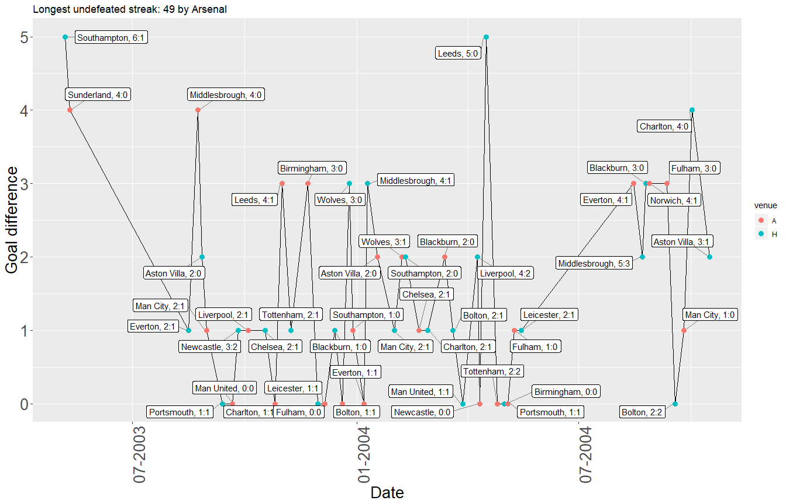
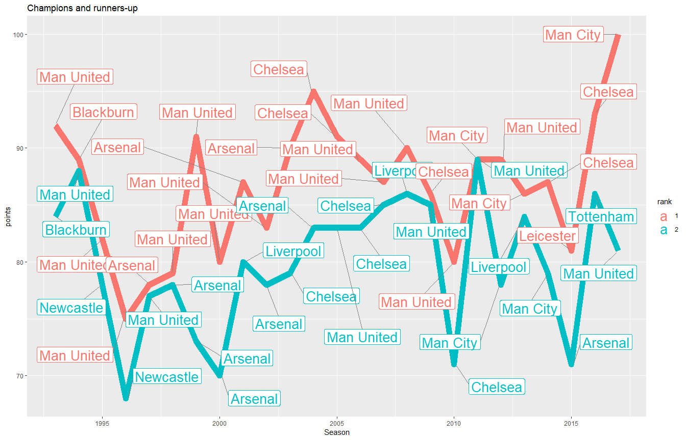

Hey, guys!

Here's my EDA on the PL fixtures. From them I also derived the seasonal standings. Have a look below and see what I found.


```
## Warning: package 'tidyverse' was built under R version 3.4.4
```

```
## Warning: package 'ggplot2' was built under R version 3.4.4
```

```
## Warning: package 'ggrepel' was built under R version 3.4.4
```

```
## Warning: package 'lubridate' was built under R version 3.4.4
```

```
## Warning: package 'ggpubr' was built under R version 3.4.4
```

```
## Warning: package 'scales' was built under R version 3.4.4
```

```
## Warning: package 'highcharter' was built under R version 3.4.4
```

# How long they have been in the EPL?
<!-- -->

# Top teams' W/D/L balance


Please note that the 1993-94 and 1994-95 seasons saw 22 playing in the PL.
<!-- -->

# Comebacks: What a drama!?!

Look at that! That's the number of comebacks per season. Unless you are on the wrong side of the scoreboard, it's always fun to watch these games. Here's theit distribution in time.

Note: No HT-FT data is available for 1993-94 and 1994-95 season
<!-- -->

The following functions make it possible to identify sequences of difference game outcomes.

# Streaks {.tabset}

The y-axis on the figures below represents the goal difference, thus they highlight not only the length of a streak but also confidence of the attacking (winning/undefeated streak) or defending players(winless streak).

Please use the tabs to explore all longest streaks regarding the outcome.

## Winning
<!-- -->

## Winless
<!-- -->

##Undefeated
<!-- -->

#Standings


##Number of titles
I feel like I owe it to the Man Utd and Chelsea fans and I've included the number of titles won by any team in the Premier League era.
<!--html_preserve--><div id="htmlwidget-8a2b64eec188595499fc" style="width:100%;height:500px;" class="highchart html-widget"></div>
<script type="application/json" data-for="htmlwidget-8a2b64eec188595499fc">{"x":{"hc_opts":{"title":{"text":"Premier League Titles"},"yAxis":{"title":{"text":[]},"type":"linear"},"credits":{"enabled":false},"exporting":{"enabled":false},"plotOptions":{"series":{"turboThreshold":0,"showInLegend":false,"marker":{"enabled":true}},"treemap":{"layoutAlgorithm":"squarified"},"bubble":{"minSize":5,"maxSize":25},"scatter":{"marker":{"symbol":"circle"}}},"annotationsOptions":{"enabledButtons":false},"tooltip":{"delayForDisplay":10},"colorAxis":{"auxpar":null},"series":[{"group":"group","data":[{"team":"Arsenal","titles":3,"value":3,"colorValue":3,"size":20,"name":"Arsenal"},{"team":"Blackburn","titles":1,"value":1,"colorValue":1,"size":20,"name":"Blackburn"},{"team":"Chelsea","titles":5,"value":5,"colorValue":5,"size":20,"name":"Chelsea"},{"team":"Leicester","titles":1,"value":1,"colorValue":1,"size":20,"name":"Leicester"},{"team":"Man City","titles":3,"value":3,"colorValue":3,"size":20,"name":"Man City"},{"team":"Man United","titles":12,"value":12,"colorValue":12,"size":20,"name":"Man United"}],"type":"treemap"}],"xAxis":{"type":"category","title":{"text":"team"},"categories":null}},"theme":{"colors":["#F45B5B","#8085E9","#8D4654","#7798BF","#AAEEEE","#FF0066","#EEAAEE","#55BF3B","#DF5353"],"chart":{"backgroundColor":null,"divBackgroundImage":"http://www.highcharts.com/samples/graphics/sand.png","style":{"fontFamily":"Signika, serif"}},"title":{"style":{"color":"black","fontSize":"16px","fontWeight":"bold"}},"subtitle":{"style":{"color":"black"}},"tooltip":{"borderWidth":0},"legend":{"itemStyle":{"fontWeight":"bold","fontSize":"13px"}},"xAxis":{"labels":{"style":{"color":"#6e6e70"}}},"yAxis":{"labels":{"style":{"color":"#6e6e70"}}},"plotOptions":{"series":{"shadow":false},"candlestick":{"lineColor":"#404048"},"map":{"shadow":false}},"navigator":{"xAxis":{"gridLineColor":"#D0D0D8"}},"rangeSelector":{"buttonTheme":{"fill":"white","stroke":"#C0C0C8","stroke-width":1,"states":{"select":{"fill":"#D0D0D8"}}}},"scrollbar":{"trackBorderColor":"#C0C0C8"},"background2":"#E0E0E8"},"conf_opts":{"global":{"Date":null,"VMLRadialGradientURL":"http =//code.highcharts.com/list(version)/gfx/vml-radial-gradient.png","canvasToolsURL":"http =//code.highcharts.com/list(version)/modules/canvas-tools.js","getTimezoneOffset":null,"timezoneOffset":0,"useUTC":true},"lang":{"contextButtonTitle":"Chart context menu","decimalPoint":".","downloadJPEG":"Download JPEG image","downloadPDF":"Download PDF document","downloadPNG":"Download PNG image","downloadSVG":"Download SVG vector image","drillUpText":"Back to {series.name}","invalidDate":null,"loading":"Loading...","months":["January","February","March","April","May","June","July","August","September","October","November","December"],"noData":"No data to display","numericSymbols":["k","M","G","T","P","E"],"printChart":"Print chart","resetZoom":"Reset zoom","resetZoomTitle":"Reset zoom level 1:1","shortMonths":["Jan","Feb","Mar","Apr","May","Jun","Jul","Aug","Sep","Oct","Nov","Dec"],"thousandsSep":" ","weekdays":["Sunday","Monday","Tuesday","Wednesday","Thursday","Friday","Saturday"]}},"type":"chart","fonts":"Signika","debug":false},"evals":[],"jsHooks":[]}</script><!--/html_preserve-->

##Point difference between champion and runner-up
Last but not least, we have diffrence in points between the champion and the runner-up. Labels are also added to signify the actual winner and second-placed teams.
<!-- -->
